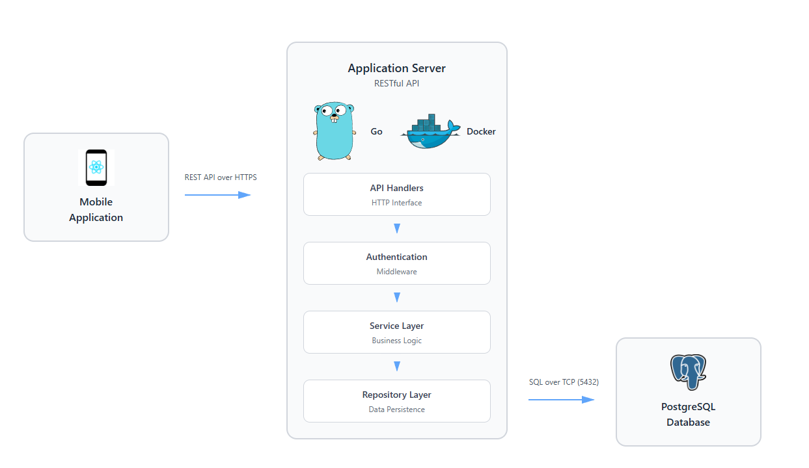
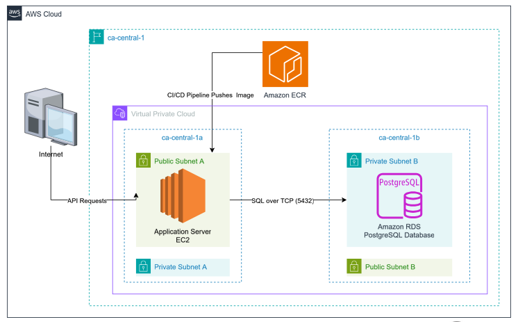

# CGC-2026 Server

Bakcend server for the Garmin Smart Knee Sleeve capstone project. This service powers the mobile application by exposing a REST API to manage the users workout sessions and metrics.

The other key repositories can be found here:

[Mobile Application](https://github.com/CGC-2026/client/)

[Device Firmaware](https://github.com/CGC-2026/device-firmware)

## Overview

At a high level, the backend is responsible for:
- authenticating requests and associating them with application users
- storing calibration data used by the knee-tracking workflow
- creating and managing workout sessions, sets, and reps
- persisting workout history for providing data analytics in the app

---

## High-level Architecture



### Backend request flow

1. The Mobile Application sends HTTPS requests to the backend.
2. Requests enter the HTTP handler layer
3. Middle handlers authentication and logging
4. The service layer applies our desired business logic and dictates application behaviour
5. The repository layer persists and retrieves data from PostgreSQL.

## Cloud Deployment Architecture



The production environment is deployed on AWS and currently uses:

- **Amazon EC2**: Application server
- **Amazon RDS for PostgreSQL**: Persistent relational storage
- **Amazon ECR**: Container image storage
- **Github Actions + OIDC** for CI/CD deployment
- **Cloudwatch Logs** for backend request and application log collection

The application server runs and a public subnet and communicates with the PostgreSQL database, The database is deployed in private subnets, and both resources exist inside a Virtual Private Cloud (VPC).

---

## Repository Structure

```text
cmd/              # Application entrypoint
internal/         # Core go application code
   core/service/  # Business logic
   data/          # Connection to repository layer
   db/            # sqlc-generated database code
   http/
      handlers/   # HTTP handlers
      middleware/ # Auth, logging, and HTTP middleware
      responses/  # Shared response helpers
infra/            # AWS Infrastrucuture Configuration (OpenTofu)
db/
   migration/     # Goose migrations
   queries/       # Source SQL for sqlc
   seeds/         # Development/Production seed data
scripts/          # CI/CD and production management scripts
```

---

## Prerequisites

1. **Go**
   Go 1.25 or higher: <https://go.dev/dl/>

2. **Make (Optional)**
   If on windows, a version of make must be installed, Chocolatey package manager is recommended: <https://chocolatey.org/install>

   - Once Chocolatey is installed run the following command in an elevated powershell: `choco install make`

3. **Docker Desktop**  
   Download: [docker.com/products/docker-desktop](https://www.docker.com/products/docker-desktop)  
   → Make sure Docker is running in the background

## Creating the environment

1. **Create environment file**
   Mac/Unix: `cp .env.example .env`
   Windows: `copy .env.example .env`

2. **Ensure Dependencies are up to date**

   ```bash
    go mod download
   ```

3. **Ensure docker is running and launch container**

   ```bash
   docker compose up --build
   ```

4. **Confirm server status**

   - Navigate to <http://localhost:8080/health>
   - Status should be "OK"

## Package Management

This project uses Go Modules for dependency management. Here's how to work with packages:

### Adding a New Package

To add a new dependency to the project:

```bash
go get github.com/example/package
```

This will automatically update your `go.mod` and `go.sum` files.

### Installing Dependencies

After cloning the repository, install all dependencies:

```bash
go mod download
```

### Updating Dependencies

To update dependencies and clean up unused ones:

```bash
go mod tidy
```

This command ensures your `go.mod` file correctly reflects all dependencies used in the codebase.

## Using Make

This project includes a Makefile with common commands listed below.
Alternatively, run `make` to list all available commands

```bash
# Go Application
make build        # Build the application
make run          # Run the application
make dev          # Run the application with live reload (docker-compose)
make test         # Run tests
make clean        # Clean build artifacts

# Database & migrations
make migrations-status   # Show goose migration status
make migrations-up       # Apply all up migrations
make migrations-down     # Roll back one migration
make migrations-reset    # Roll back ALL migrations to base (dangerous in prod!)
make migrations-create   # Create a new migration (pass name=foo)
make migrations-redo     # Re-run the latest migration (down then up)
make migrations-up-to    # Migrate up to a specific version (pass version=<num>)
make migrations-down-to  # Migrate down to a specific version (pass version=<num>)

# DB helpers
make db-seed       # Seed the database with test

# sqlc (DB codegen)
make sqlc-gen      # Run sqlc generate inside the dev container
make sqlc-vet      # Run sqlc vet (validate) inside the dev container
```

## Live Reload for Development

This project supports live reload using [Air](https://github.com/air-verse/air) via Docker. This allows you to automatically rebuild and restart the server when code changes are detected.

### Using Live Reload

To use live reload, simply run:

```bash
# Using the make command (recommended)
make dev
```

The configuration for Air is in the `.air.toml` file in the project root. No need to install Air locally as it runs in a Docker container.

## Running Migrations

To run migrations:
`make migrations-up`

## Working with sqlc

This project uses `sqlc` to generate type-safe Go database code from SQL queries. `sqlc` is run inside the `dev` container so it uses the same database client and environment as the app.

Common commands

```bash
# Validate SQL and schema without generating code
make sqlc-vet

# Generate Go code from queries
make sqlc-gen
```

## Database Access (pgweb)

For a simple web-based UI to inspect the database, this project includes [pgweb](https://github.com/sosedoff/pgweb).

Once the containers are running (`make dev`), pgweb will be available at:

<http://localhost:3001/>

From here you can:

- Browse tables and data
- Run ad-hoc SQL queries
- Inspect schema and relationships

This is useful for debugging or quick database exploration without using `psql`.

---

## Development Authentication Bypass Setp

For local development and testing of protected endpoints:

### Enable Development Mode

In your `.env` file:

```bash
APP_ENV=development
DEV_BYPASS_SECRET=your-local-secret
```

When calling protected endpoints, the following headers are required:

- `X-Dev-Secret`
- `X-Dev-User-Id`

## Documentation

- Go: <https://go.dev/doc/>
- Goose: <https://github.com/pressly/goose>
- Sqlc: <https://docs.sqlc.dev/en/stable/tutorials/getting-started-postgresql.html>
- pgx: <https://github.com/jackc/pgx/wiki/Getting-started-with-pgx>